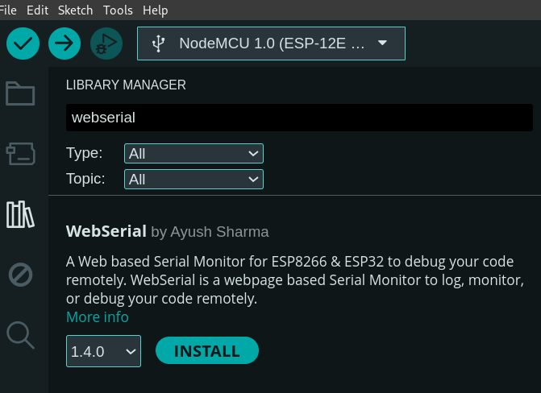

## Install Arduino IDE

First Install **Arduino IDE** for **Coding** and **Uploading** code

Install packages for **Window | Linux | mac-OS** from:

```
https://www.arduino.cc/en/software
```
### Manual Install Using Flatpak(For Linux)

Make sure you follow the [setup guide for your Linux distribution](https://flathub.org/setup) before installing

```
flatpak install flathub cc.arduino.IDE2
```

### Run
```
flatpak run cc.arduino.IDE2
```


# Importing Board Manager

**Arduino Board Manager** is installed  by **Default** 

To install **ESP8266 NodeMCU** board  :

1. Launch the Arduino IDE
2. In your Arduino IDE, go to **File**> **Preferences**
3. Enter 
```
 http://arduino.esp8266.com/stable/package_esp8266com_index.json
```
into the “Additional Boards Manager URLs” field as shown in the figure below. Then, click the “OK” button:
6. Now you are done.

A Web based Serial Monitor for ESP8266 & ESP32 to debug your code remotely.  
WebSerial is a webpage based Serial Monitor to log, monitor, or debug your code remotely.

## Compatibility
This library is compatible with the **esp8266, esp32** architectures.


## Install WebSerial Library

1. Navigate to **Sketch > Include Library > Manage Libraries** or using 
shortcut ``ctrl + shift + I``
2. Search for **Webserial**  
   

3. Install the latest version
4. You also need to install the [ESPAsyncWebServer](https://github.com/me-no-dev/ESPAsyncWebServer) and the [AsyncTCP](https://github.com/me-no-dev/AsyncTCP) libraries. Click the following links to download the libraries’ files.

- [ESPAsyncWebServer](https://github.com/me-no-dev/ESPAsyncWebServer/archive/refs/heads/master.zip)
- [AsyncTCP](https://github.com/me-no-dev/AsyncTCP/archive/refs/heads/master.zip)

To install these libraries, click on the previous links to download the libraries’ files. Then, in your Arduino IDE, go to **Sketch** > **Include Library** > **Add .ZIP Library…**
5. Now you are Done.


# Arduino TickTwo Library v4.x.x for ESP and mbed based Arduino devices
The **Arduino TickTwo Library** allows you to create easily Ticker callbacks, which can call a function in a predetermined interval. You can change the number of repeats of the callbacks, if repeats is 0 the ticker runs in endless mode. Works like a "thread", where a secondary function will run when necessary. The library use no interupts of the hardware timers and works with the **micros() / millis()** function. You are not (really) limited in the number of Tickers.

## Installation

1. "Download":[https://github.com/sstaub/TickTwo/archive/master.zip](https://github.com/sstaub/TickTwo/archive/master.zip) the Master branch from GitHub.
2.  Navigate to **Sketch > Include Library > Add .ZIP Library
3. Navigate to download folder where the .zip file is located and select it.
4. Arduino IDE automatically install library from the zip file.
5. Now `TickTwo` Library is ready to be used.

## How to use

First, include the TimerObject to your project:

```
#include "TickTwo.h"
```

Now, you can create a new object in setup():

```
TickTwo tickerObject(callbackFunction, 1000); 
tickerObject.start(); //start the ticker.
```

In your loop(), add:

```
tickerObject.update(); //it will check the Ticker and if necessary, it will run the callback function.
```

## IMPORTANT

If you use delay(), the Ticker will be ignored! You cannot use delay() command with the TimerObject. Instead of using delay, you can use the Ticker itself. For example, if you need that your loop run twice per second, just create a Ticker with 500 ms. It will have the same result that delay(500), but your code will be always state.
